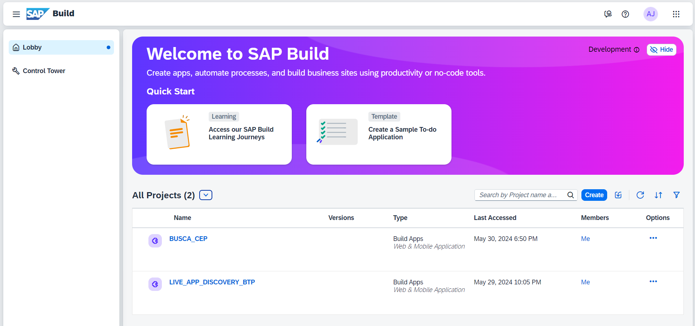

# SAP Build Apps Applications

> This repository will contain all my apps created by build apps

## 💻 Requirements

Before you start, make sure you meet the following requirements:

- You have created a trial account on SAP BTP
- You have an environment ready to use Build Apps

## ☕ Using projects

To use any of the projects, follow these steps:

- first, clone the repository so that you have the project file you want.
- second, import the .zip file of the desired project into Build Apps