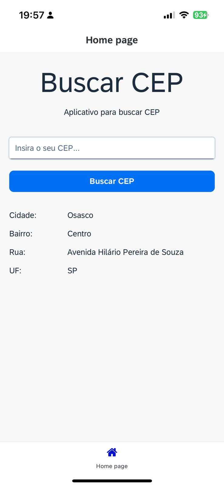

## Busca CEP

  

In this project, I created a zip code search application.

Using the viacep API data service.

SAP documentation on SAP Build Apps:
https://help.sap.com/docs/build-apps

## 💻 Requirements

Before you start, make sure you meet the following requirements:

- You have created a trial account on SAP BTP
- You have an environment ready to use Build Apps

## ☕ Using projects

To use the project, follow these steps:

- First, clone the repository so that you can access the file for that project.
- Secondly, import the project's .zip file into Build Apps