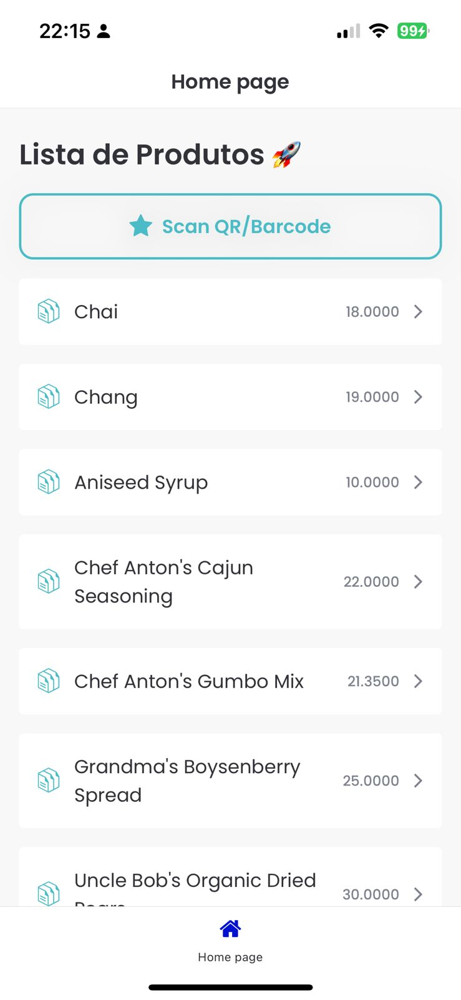
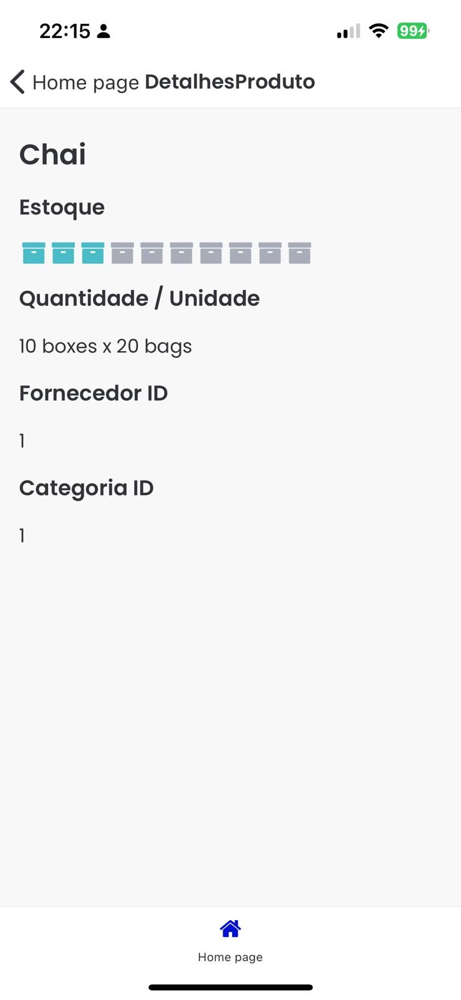

## Descrição
Neste HandsOn será a construção de uma aplicação de Lista de Produtos com a funcionalidade da busca de produto com QRCode.

Utilizando oData Service Northwind.

Documentação da SAP sobre SAP Build Apps:
https://help.sap.com/docs/build-apps

## Requisitos
Para a utilização do projeto é necessário a criação prévia de um ambiente com o SAP Build.

## Pré-visualização

  
  

